# ElasticSearch

## 健康状态

> 查看集群健康状态

```aidl
# 查集群健康状况，显示列名
# 绿：一切正常，黄：有副本不可用，红：有些数据不能使用
GET /_cat/health?v

# 查集群健康状况，隐藏列名
GET /_cat/health
```

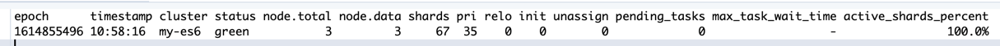

> 查看集群节点健康状态

```aidl
GET /_cat/nodes?v
```

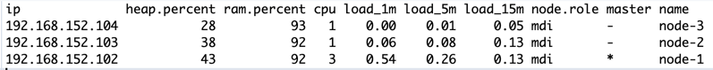

> 查看集群索引状态

```aidl
GET /_cat/indices?v
```

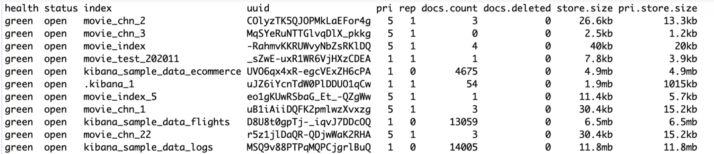

## 索引

> 创建索引

```aidl
# 创建索引
PUT movie_index?pretty
```

> 删除索引

```aidl
DELETE movie_index
```

> 索引使用分片情况

```aidl
GET /_cat/shards/movie_index?v
```

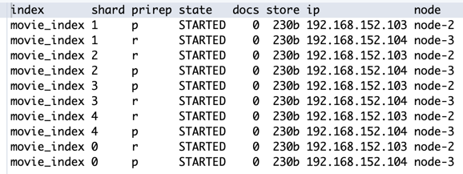

## 文档(创建、更新、删除)

> 创建文档（有就替换，没有就插入，幂等）

```aidl
# 指定ID创建（幂等）
PUT /movie_index/movie/1
{ 
  "id":100,
  "name":"operation red sea",
  "doubanScore":8.5,
  "actorList":[  
    {"id":1,"name":"zhang yi"},
    {"id":2,"name":"hai qing"},
    {"id":3,"name":"zhang han yu"}
  ]
}

PUT /movie_index/movie/2
{
  "id":200,
  "name":"operation meigong river",
  "doubanScore":8.0,
  "actorList":[  
    {"id":3,"name":"zhang han yu"}
  ]
}

PUT /movie_index/movie/3
{
  "id":300,
  "name":"incident red sea",
  "doubanScore":5.0,
  "actorList":[  
    {"id":4,"name":"zhang san feng"}
  ]
}
```

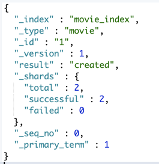

> 替换文档（id可选，如果没有就自动生成随机字符串作为ID，非幂等）

```aidl
POST /movie_index/movie/
{
  "id":300,
  "name":"incident red sea",
  "doubanScore":5.0,
  "actorList":[  
    {"id":4,"name":"zhang cuishan"}
  ]
}
```

> 指定ID查询文档

```aidl
GET /movie_index/movie/1?pretty
```

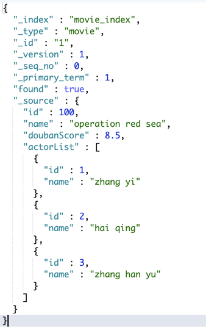

> 查找所有文档

```aidl
# 查询全部
GET /movie_index/_search 

# 查询全部，截取10条
GET /movie_index/_search
{
	"size":10
}
```

> 指定ID删除文档

```aidl
DELETE /movie_index/movie/3
```

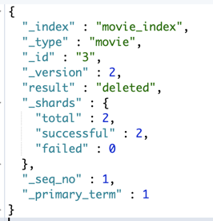

> > 删除索引会立即回收空间，删除文档只是标记删除，segmeng merge时才会触发物理删除。

> 更新文档局部字段

```aidl
POST /movie_index/movie/3/_update?pretty
{
    "doc": {"name":"wudang"}
}
```

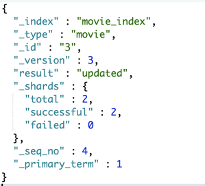

> 查找匹配项，基于脚本进行修改

```aidl
# 找到actorList.id = 1的项，然后将其actorList.id=3的name改为ttt
POST /movie_index/_update_by_query
{
    "query": {
        "match":{
            "actorList.id":1
        }  
    },
    "script": {
        "lang": "painless",
        "source":"for(int i=0;i<ctx._source.actorList.length;i++){if(ctx._source.actorList[i].id==3){ctx._source.actorList[i].name='tttt'}}"
    }
}
```

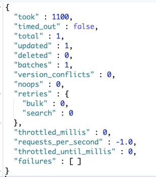

> 删除指定文档的指定属性

```aidl
# 删除id=1文档的name属性
POST /movie_index/movie/1/_update
{
    "script" : "ctx._source.remove('name')"
}
```

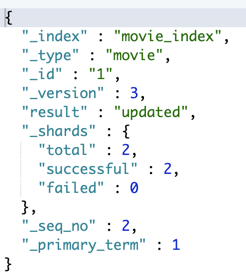

> 根据条件删除指定文档

```aidl
POST /movie_index/_delete_by_query
{
  "query": {
    "match_all": {}
  }
}
```

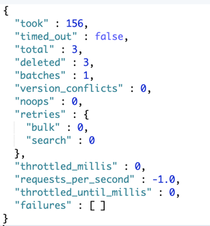

> 批处理-插入

```aidl
# 注意：Kibana要求批量操作的json内容写在同一行，第一行提供ID，第二行为文档内容
# index 表示动作是插入，对应更新为 update，删除为 delete
POST /movie_index/movie/_bulk
{"index":{"_id":66}}
{"id":300,"name":"incident red sea","doubanScore":5.0,"actorList":[{"id":4,"name":"zhang cuishan"}]}
{"index":{"_id":88}}
{"id":300,"name":"incident red sea","doubanScore":5.0,"actorList":[{"id":4,"name":"zhang cuishan"}]}
```


> 批处理-更新和删除

```aidl
POST /movie_index/movie/_bulk
{"update":{"_id":"66"}}
{"doc": { "name": "wudangshanshang" } }
{"delete":{"_id":"88"}}
```

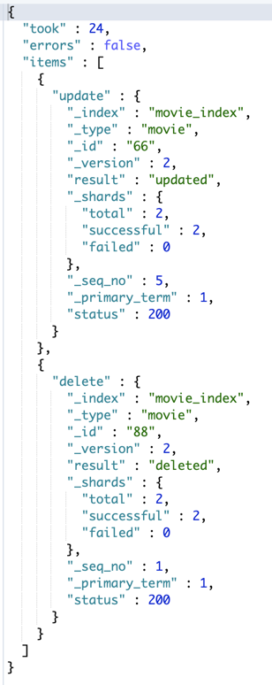

## 文档(查询)

> 指定id查询

```aidl
# id=66的文档
GET /movie_index/_search?q=_id:66
```

> 带请求体的查询

```aidl
GET /movie_index/_search
{
    "query": {
        "match_all": {}
    }
}
```

> 按分词进行查询

```aidl
GET movie_index/movie/_search
{
  "query":{
    "match": {"name":"operation red sea"}
  }
}

# 分析：name为text类型，按分词拆分为 operation、red、sea，一旦匹配一个，就可以选出
{
  "took" : 14,
  "timed_out" : false,
  "_shards" : {
    "total" : 5,
    "successful" : 5,
    "skipped" : 0,
    "failed" : 0
  },
  "hits" : {
    "total" : 3,
    "max_score" : 0.8630463,
    "hits" : [
      {
        "_index" : "movie_index",
        "_type" : "movie",
        "_id" : "1",
        "_score" : 0.8630463,
        "_source" : {
          "id" : 100,
          "name" : "operation red sea",
          "doubanScore" : 8.5,
          "actorList" : [
            {
              "id" : 1,
              "name" : "zhang yi"
            },
            {
              "id" : 2,
              "name" : "hai qing"
            },
            {
              "id" : 3,
              "name" : "zhang han yu"
            }
          ]
        }
      },
      {
        "_index" : "movie_index",
        "_type" : "movie",
        "_id" : "3",
        "_score" : 0.5753642,
        "_source" : {
          "id" : 300,
          "name" : "incident red sea",
          "doubanScore" : 5.0,
          "actorList" : [
            {
              "id" : 4,
              "name" : "zhang san feng"
            }
          ]
        }
      },
      {
        "_index" : "movie_index",
        "_type" : "movie",
        "_id" : "2",
        "_score" : 0.2876821,
        "_source" : {
          "id" : 200,
          "name" : "operation meigong river",
          "doubanScore" : 8.0,
          "actorList" : [
            {
              "id" : 3,
              "name" : "zhang han yu"
            }
          ]
        }
      }
    ]
  }
}
```

> 不按分词进行查询

```aidl
GET movie_index/movie/_search
{
  "query":{
    "match": {"name.keyword":"operation red sea"}
  }
}

# 分析: name.keyword不会进行分词，内容完全一致的，才会被选出
{
  "took" : 5,
  "timed_out" : false,
  "_shards" : {
    "total" : 5,
    "successful" : 5,
    "skipped" : 0,
    "failed" : 0
  },
  "hits" : {
    "total" : 1,
    "max_score" : 0.2876821,
    "hits" : [
      {
        "_index" : "movie_index",
        "_type" : "movie",
        "_id" : "1",
        "_score" : 0.2876821,
        "_source" : {
          "id" : 100,
          "name" : "operation red sea",
          "doubanScore" : 8.5,
          "actorList" : [
            {
              "id" : 1,
              "name" : "zhang yi"
            },
            {
              "id" : 2,
              "name" : "hai qing"
            },
            {
              "id" : 3,
              "name" : "zhang han yu"
            }
          ]
        }
      }
    ]
  }
}
```

> 按分词子属性查询

```aidl
GET movie_index/movie/_search
{
  "query":{
    "match": {"actorList.name":"zhang han yu"}
  }
}

# 分析，actorList.name 为text类型，这里会按分词进行查询，即将'zhang han yu' 拆分为zhang、han、yu三个单词，各自匹配
# 命中3条
```

> 分词子属性不分词查询

```aidl
# 按分词子属性查询
GET movie_index/movie/_search
{
  "query":{
    "match": {"actorList.name.keyword":"zhang han yu"}
  }
}

# 命中两条
```

> 短语查询

```aidl
GET movie_index/movie/_search
{
  "query":{
    "match_phrase": {"actorList.name":"zhang han yu"}
  }
}

# match_phrase 会把内容当成整体
# 命中两条
```

> term 精准匹配（必须使用keyword）

```aidl
GET movie_index/movie/_search
{
  "query":{
  	"term":{
        "actorList.name.keyword":"zhang han yu"
    }
  }
}
```

> fuzzy 模糊匹配

```aidl
# 容错匹配
GET movie_index/movie/_search
{
    "query":{
      "fuzzy": {"name":"rad"}
    }
}	
# 返回2个结果，会把incident red sea和operation red sea匹配上
```

> 先过滤，再匹配

```aidl
# 先过滤，再匹配
GET movie_index/movie/_search
{
    "query":{
      "match": {"name":"red"}
    },
    "post_filter":{
      "term": {
        "actorList.id": 3
      }
    }
}
```

> 过滤和匹配同时使用

```aidl
GET movie_index/movie/_search
{
  "query": {
    "bool": {
       "must": [
        {"match": {
          "name": "red"
        }}
      ],
      "filter": [
        {"term": { "actorList.id": "1"}},
        {"term": {"actorList.id": "3"}}
      ]
    }
  }
}
```

> 按范围过滤

```aidl
GET movie_index/movie/_search
{
  "query": {
    "range": {
      "doubanScore": {
        "gte": 6,
        "lte": 8.5
      }
    }
  }
}
```

> 排序

```aidl
GET movie_index/movie/_search
{
     "query":{
        "match": {"name":"red sea"}
     },
     "sort": {
          "doubanScore": {
            "order": "desc"
          }
    }
}

{
  "took" : 28,
  "timed_out" : false,
  "_shards" : {
    "total" : 5,
    "successful" : 5,
    "skipped" : 0,
    "failed" : 0
  },
  "hits" : {
    "total" : 2,
    "max_score" : null,
    "hits" : [
      {
        "_index" : "movie_index",
        "_type" : "movie",
        "_id" : "1",
        "_score" : null,
        "_source" : {
          "id" : 100,
          "name" : "operation red sea",
          "doubanScore" : 8.5,
          "actorList" : [
            {
              "id" : 1,
              "name" : "zhang yi"
            },
            {
              "id" : 2,
              "name" : "hai qing"
            },
            {
              "id" : 3,
              "name" : "zhang han yu"
            }
          ]
        },
        "sort" : [
          8.5
        ]
      },
      {
        "_index" : "movie_index",
        "_type" : "movie",
        "_id" : "3",
        "_score" : null,
        "_source" : {
          "id" : 300,
          "name" : "incident red sea",
          "doubanScore" : 5.0,
          "actorList" : [
            {
              "id" : 4,
              "name" : "zhang san feng"
            }
          ]
        },
        "sort" : [
          5.0
        ]
      }
    ]
  }
}
```

> 分页

```aidl
# 从from开始取size条，默认from为0
GET movie_index/movie/_search
{
  "query": { "match_all": {} },
  "from": 1,
  "size": 1
}
```

> 抓取指定字段（name、doubanScore）

```aidl
GET movie_index/movie/_search
{
  "query": { "match_all": {} },
  "_source": ["name", "doubanScore"]
}
```

> 高亮显示，<em>标签包裹命中词条

```aidl
GET movie_index/movie/_search
{
    "query":{
      "match": {"name":"red sea"}
    },
    "highlight": {
      "fields": {"name":{} }
    }
}

{
  "took" : 181,
  "timed_out" : false,
  "_shards" : {
    "total" : 5,
    "successful" : 5,
    "skipped" : 0,
    "failed" : 0
  },
  "hits" : {
    "total" : 2,
    "max_score" : 0.5753642,
    "hits" : [
      {
        "_index" : "movie_index",
        "_type" : "movie",
        "_id" : "1",
        "_score" : 0.5753642,
        "_source" : {
          "id" : 100,
          "name" : "operation red sea",
          "doubanScore" : 8.5,
          "actorList" : [
            {
              "id" : 1,
              "name" : "zhang yi"
            },
            {
              "id" : 2,
              "name" : "hai qing"
            },
            {
              "id" : 3,
              "name" : "zhang han yu"
            }
          ]
        },
        "highlight" : {
          "name" : [
            "operation <em>red</em> <em>sea</em>"
          ]
        }
      },
      {
        "_index" : "movie_index",
        "_type" : "movie",
        "_id" : "3",
        "_score" : 0.5753642,
        "_source" : {
          "id" : 300,
          "name" : "incident red sea",
          "doubanScore" : 5.0,
          "actorList" : [
            {
              "id" : 4,
              "name" : "zhang san feng"
            }
          ]
        },
        "highlight" : {
          "name" : [
            "incident <em>red</em> <em>sea</em>"
          ]
        }
      }
    ]
  }
}
```

## 统计

> terms 统计，默认为count

```aidl
# 统计各演员各自参演多少部电影，且不显示明细(size=0)
GET movie_index/movie/_search
{
  "size":0,
  "aggs": {
    "myAGG": {
      "terms": {
        "field": "actorList.name.keyword"
      }
    }
  }
}

aggs:表示聚合
myAGG：给聚合取的名字，
trems：表示分组，相当于groupBy
field：指定分组字段

{
  "took" : 17,
  "timed_out" : false,
  "_shards" : {
    "total" : 5,
    "successful" : 5,
    "skipped" : 0,
    "failed" : 0
  },
  "hits" : {
    "total" : 3,
    "max_score" : 0.0,
    "hits" : [ ]
  },
  "aggregations" : {
    "myAGG" : {
      "doc_count_error_upper_bound" : 0,
      "sum_other_doc_count" : 0,
      "buckets" : [
        {
          "key" : "zhang han yu",
          "doc_count" : 2
        },
        {
          "key" : "hai qing",
          "doc_count" : 1
        },
        {
          "key" : "zhang san feng",
          "doc_count" : 1
        },
        {
          "key" : "zhang yi",
          "doc_count" : 1
        }
      ]
    }
  }
}
```

> 嵌套agg

```aidl
# 嵌套agg
# 内层先计算平均值，外层排序
GET movie_index/movie/_search
{ 
  "size":0,
  "aggs": {
    "groupby_actor_id": {
      "terms": {
        "field": "actorList.name.keyword" ,
        "order": {
          "avg_score": "desc"
          }
      },
      "aggs": {
        "avg_score":{
          "avg": {
            "field": "doubanScore" 
          }
        }
       }
    } 
  }
}

外层先基于actorList.name.keyword分好组，内层再进行平均值计算，然后在外层基于平均值排序
{
  "took" : 18,
  "timed_out" : false,
  "_shards" : {
    "total" : 5,
    "successful" : 5,
    "skipped" : 0,
    "failed" : 0
  },
  "hits" : {
    "total" : 3,
    "max_score" : 0.0,
    "hits" : [ ]
  },
  "aggregations" : {
    "groupby_actor_id" : {
      "doc_count_error_upper_bound" : 0,
      "sum_other_doc_count" : 0,
      "buckets" : [
        {
          "key" : "hai qing",
          "doc_count" : 1,
          "avg_score" : {
            "value" : 8.5
          }
        },
        {
          "key" : "zhang yi",
          "doc_count" : 1,
          "avg_score" : {
            "value" : 8.5
          }
        },
        {
          "key" : "zhang han yu",
          "doc_count" : 2,
          "avg_score" : {
            "value" : 8.25
          }
        },
        {
          "key" : "zhang san feng",
          "doc_count" : 1,
          "avg_score" : {
            "value" : 5.0
          }
        }
      ]
    }
  }
}
```

## 分词

> 默认分词器对英文短语进行分词

```aidl
# ALPHANUM 为默认分词器（字母分词器）
GET _analyze
{
  "text":"hello world"
}
```

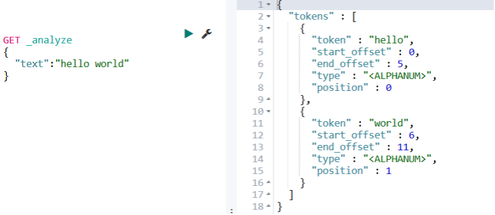

> 默认分词器对中文短语进行分词

```aidl
GET _analyze
{
  "text":"小米手机"
}
```

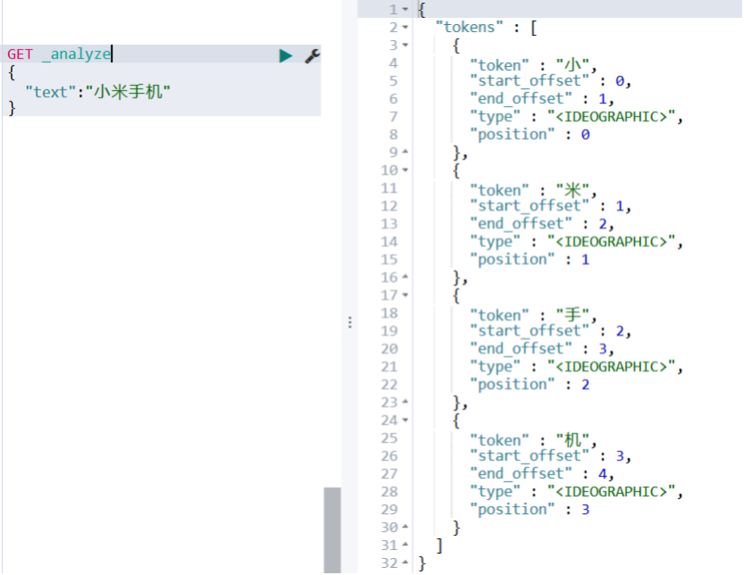

> 使用ik分词器对中文短语进行分词(ik_smart)

```aidl
GET movie_index/_analyze
{  
"analyzer": "ik_smart",
"text": "我是中国人"
}
```

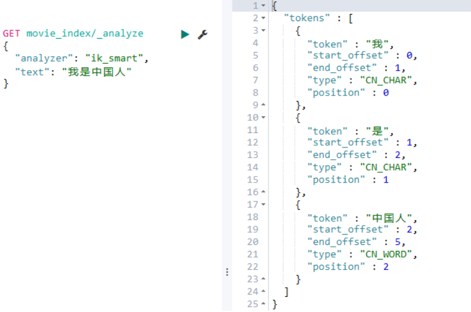

> 使用ik分词器对中文短语进行分词(ik_max_word)

```aidl
GET movie_index/_analyze
{  
"analyzer": "ik_max_word",
"text": "我是中国人"
}

{
  "tokens" : [
    {
      "token" : "我",
      "start_offset" : 0,
      "end_offset" : 1,
      "type" : "CN_CHAR",
      "position" : 0
    },
    {
      "token" : "是",
      "start_offset" : 1,
      "end_offset" : 2,
      "type" : "CN_CHAR",
      "position" : 1
    },
    {
      "token" : "中国人",
      "start_offset" : 2,
      "end_offset" : 5,
      "type" : "CN_WORD",
      "position" : 2
    },
    {
      "token" : "中国",
      "start_offset" : 2,
      "end_offset" : 4,
      "type" : "CN_WORD",
      "position" : 3
    },
    {
      "token" : "国人",
      "start_offset" : 3,
      "end_offset" : 5,
      "type" : "CN_WORD",
      "position" : 4
    }
  ]
}
```

> 使用IK分词器对英文短语进行分词(ik_smart)

```aidl
GET movie_index/_analyze
{  
  "analyzer": "ik_smart", 
  "text": "hello world"
}

{
  "tokens" : [
    {
      "token" : "hello",
      "start_offset" : 0,
      "end_offset" : 5,
      "type" : "ENGLISH",
      "position" : 0
    },
    {
      "token" : "world",
      "start_offset" : 6,
      "end_offset" : 11,
      "type" : "ENGLISH",
      "position" : 1
    }
  ]
}
```

> 更新词典后，对历史数据重新分词

```aidl
POST movies_index_chn/_update_by_query?conflicts=proceed
```

## mapping 映射

> 自动创建index的mapping

```aidl
PUT /movie_chn_1/movie/1
{ "id":1,
  "name":"红海行动",
  "doubanScore":8.5,
  "actorList":[  
    {"id":1,"name":"张译"},
    {"id":2,"name":"海清"},
    {"id":3,"name":"张涵予"}
   ]
}

PUT /movie_chn_1/movie/2
{
  "id":2,
  "name":"湄公河行动",
  "doubanScore":8.0,
  "actorList":[  
    {"id":3,"name":"张涵予"}
  ]
}

PUT /movie_chn_1/movie/3
{
  "id":3,
  "name":"红海事件",
  "doubanScore":5.0,
  "actorList":[  
    {"id":4,"name":"张三丰"}
  ]
}

GET movie_chn_1/_mapping
```

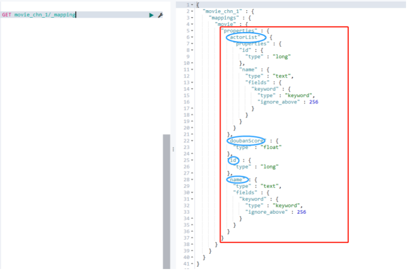

> mapping未指定ik分词器，按默认分词器分词

```aidl
# 使用默认分词器，会将"海行"，拆分为“海”、“行”，然后进行匹配
GET /movie_chn_1/movie/_search
{
    "query": {
        "match": {
            "name": "海行"
        }
    }
}
# 命中三条
```

> 手动创建mapping(指定ik分词器)

```aidl
PUT movie_chn_2
{
  "mappings": {
    "movie":{
      "properties": {
        "id":{
          "type": "long"
        },
        "name":{
          "type": "text", 
          "analyzer": "ik_smart"
        },
        "doubanScore":{
          "type": "double"
        },
        "actorList":{
          "properties": {
            "id":{
              "type":"long"
            },
            "name":{
              "type":"keyword"
            }
          }
        }
      }
    }
  }
}

# 插入记录
PUT /movie_chn_2/movie/1
{ "id":1,
  "name":"红海行动",
  "doubanScore":8.5,
  "actorList":[  
    {"id":1,"name":"张译"},
    {"id":2,"name":"海清"},
    {"id":3,"name":"张涵予"}
   ]
}

PUT /movie_chn_2/movie/2
{
  "id":2,
  "name":"湄公河行动",
  "doubanScore":8.0,
  "actorList":[  
    {"id":3,"name":"张涵予"}
  ]
}

PUT /movie_chn_2/movie/3
{
  "id":3,
  "name":"红海事件",
  "doubanScore":5.0,
  "actorList":[  
    {"id":4,"name":"张三丰"}
  ]
}
```

> 按mapping预设的ik分词器进行分词匹配

```aidl
GET /movie_chn_2/movie/_search
{
  "query": {
    "match": {
      "name": "海行"
    }
  }
}
# "海行"无法被分词，命中0条
```

## 索引

> 索引数据拷贝

```aidl
POST _reindex
{
  "source": {
    "index": "my_index_name"
  },
  "dest": {
    "index": "my_index_name_new"
  }
}

# 索引拷贝（多个往一个里面灌，重复id会覆盖）
POST _reindex
{
  "source": {
    "index": "movie_chn_2"
  },
  "dest": {
    "index": "movie_chn_3"
  }
}

GET movie_chn_3/_search
```

> 索引取别名（创建mapping时取）

```aidl
# 创建mapping时指定别名
PUT movie_chn_3
{
  "aliases": {
      "movie_chn_3_aliase": {}
  },
  "mappings": {
    "movie":{
      "properties": {
        "id":{
          "type": "long"
        },
        "name":{
          "type": "text", 
          "analyzer": "ik_smart"
        },
        "doubanScore":{
          "type": "double"
        },
        "actorList":{
          "properties": {
            "id":{
              "type":"long"
            },
            "name":{
              "type":"keyword"
            }
          }
        }
      }
    }
  }
}

# 索引拷贝（多个往一个里面灌，重复id会覆盖）
POST _reindex
{
  "source": {
    "index": "movie_chn_2"
  },
  "dest": {
    "index": "movie_chn_3"
  }
}

# 使用索引名称查询
GET /movie_chn_3/_search

# 使用索引别名查询
GET /movie_chn_3_aliase/_search
```

> 索引取别名（给已经存在索引添加别名）

```aidl
POST _aliases
{
    "actions": [
        { 
          "add":{ 
            "index": "movie_chn_3", 
            "alias": "movie_chn_3_a2" 
          }
        }
    ]
}

# 使用索引别名查询
GET /movie_chn_3_a2/_search
```

> 查询别名列表

```aidl
GET  _cat/aliases?v
```

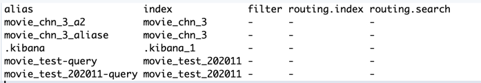

> 删除索引别名

```aidl
POST  _aliases
{
    "actions": [
        { "remove": { "index": "索引名", "alias": "索引别名" }}
    ]
}

# 删除索引别名
POST  _aliases
{
    "actions": [
        { 
          "remove":{ 
            "index": "movie_chn_3", 
            "alias": "movie_chn_3_a2" 
          }
        }
    ]
}

# 使用索引别名查询
GET /movie_chn_3_a2/_search
```

> 多个索引分组

```aidl
用途：last_three_month 统计
# 将movie_chn_1 和 movie_chn_2都归到movie_chn_query索引组下
POST  _aliases
{
    "actions": [
        { "add": { "index": "movie_chn_1", "alias": "movie_chn_query" }},
        { "add": { "index": "movie_chn_2", "alias": "movie_chn_query" }}
    ]
}

GET movie_chn_query/_search
# 命中6条

# 将movie_chn_1从movie_chn_query别名组中踢出
POST  _aliases
{
    "actions": [
        { 
          "remove":{ 
            "index": "movie_chn_1", 
            "alias": "movie_chn_query" 
          }
        }
    ]
}

GET movie_chn_query/_search
# 命中3条
```

> 给索引床架子视图

```aidl
POST  _aliases
{
    "actions": [
        { 
          "add":    
          { 
            "index": "movie_chn_1", 
            "alias": "movie_chn_1_sub_query",
            "filter": {
                "term": {  "actorList.id": "4"}
            }
          }
        }
    ]
}

GET movie_chn_1_sub_query/_search
# 命中一条
```

> 别名指向无缝切换

```aidl
POST /_aliases
{
    "actions": [
        { "remove": { "index": "movie_chn_1", "alias": "movie_chn_query" }},
        { "remove": { "index": "movie_chn_2", "alias": "movie_chn_query" }},
        { "add":    { "index": "movie_chn_3", "alias": "movie_chn_query" }}
    ]
}

# 整个操作都是原子的，不用担心数据丢失或者重复的问题
```

## 索引模板

> 基于索引模板，在插入第一条记录时自动创建索引

```aidl
# 凡是符合 movie_test* 命名的索引，为其创建特定别名{index}-query，以及归档到全局别名movie_test-query
# 当插入第一条记录时，或触发索引创建，响应可能比较慢，无法忍受的话，提前使用定时任务创建
PUT _template/template_movie2020
{
  "index_patterns": ["movie_test*"],                  
  "settings": {                                               
    "number_of_shards": 1
  },
  "aliases" : { 
    "{index}-query": {},
    "movie_test-query":{}
  },
  "mappings": {                                          
    "_doc": {
      "properties": {
        "id": {
          "type": "keyword"
        },
        "movie_name": {
          "type": "text",
          "analyzer": "ik_smart"
        }
      }
    }
  }
}

POST movie_test_202011/_doc
{
  "id":"333",
  "name":"zhang3"
}

# 使用特定索引检索
GET movie_test_202011-query/_search

# 使用全局索引检索
GET movie_test-query/_search
```

> 查看全部索引模板

```aidl
GET  _cat/templates?v
```

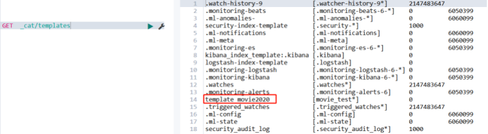

> 查看索引模板详情

```aidl
# 查看指定索引模板
GET  _template/template_movie2020
# 通配方式查看指定索引模板
GET  _template/template_movie*
```

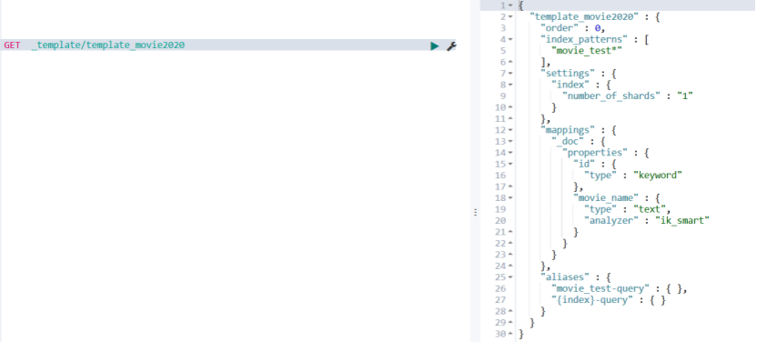

> 分隔索引

```aidl
1.是指将一个索引按指定时间段分隔成小索引，方便检索跟维护。
2.一般基于索引模板创建，在插入第一条数据时，生成相应索引，因此第一条插入记录响应可能比较慢，无法忍受的话，可提前使用定时任务创建好索引以及别名。
```

## IDEA操作ES

```aidl
一类是TransportClient 为代表的ES原生客户端，不能执行原生DSL语句必须使用它的Java api方法。
一类是以Rest ApI为主的client，最典型的就是jest。 这种客户端可以直接使用DSL语句拼成的字符串，直接传给服务端，然后返回json字符串再解析。
两种方式各有优劣，但是最近ElasticSearch官网，宣布计划在7.0以后的版本中废除TransportClient，以RestClient为主。
```
